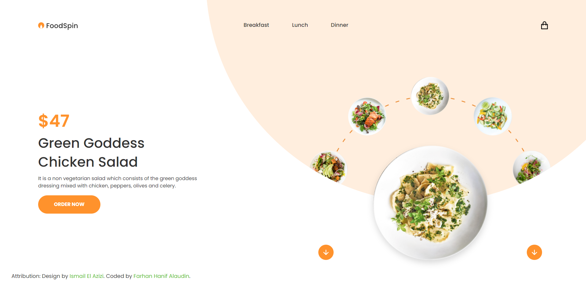

# Nuxt Food Spin

## Build Setup

```bash
# install dependencies
$ yarn install

# serve with hot reload at localhost:3000
$ yarn dev

# build for production and launch server
$ yarn build
$ yarn start

# generate static project
$ yarn generate
```

### Built with

- Nuxt.js
- SCSS
- BEM Concept

## Screenshot



## Figma Design

[FoodSpin](https://www.figma.com/community/file/825851668856380188/foodSpin-interaction).

## Attribution

Design by [Ismail El Azizi](https://www.figma.com/@ismail). Coded by [Farhan Hanif Alaudin](https://fhaladin-dev.medium.com).
